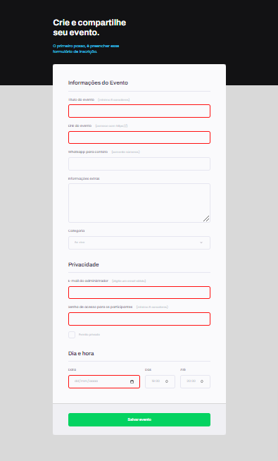

# Projeto01-Stage03

 

> Trilha Explorer

### Projeto desenvolvido durante as aulas do Módulo 1, referente ao Stage 03, do curso da Rocketseat.

Pude aprender como criar formulários para capturar dados através da web, bem como fazer validações e customizações.

 

  

## Tecnologias

- HTML
- CSS
- Git e Github

## Contato

gisellemacedo.dev@gmail.com
